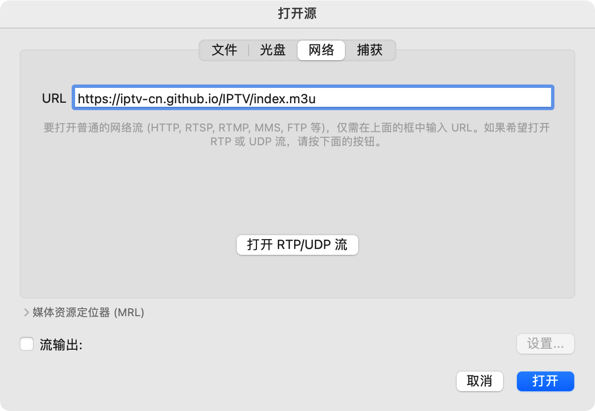

# IPTV


收集来自世界各地的公开 IPTV 频道。

Internet Protocol television (IPTV) 是通过 Internet Protocol (IP) 协议传送电视内容的技术。

## 用法

要观看 IPTV 内容，你只需复制并粘贴此链接 `https://iptv-cn.github.io/IPTV/index.m3u` 到任何支持 M3U 播放列表的播放器中即可。



你也可以使用其中一个播放列表:

- `https://iptv-cn.github.io/IPTV/index.country.m3u` (按国家分组)
- `https://iptv-cn.github.io/IPTV/index.category.m3u` (按类别分组)
- `https://iptv-cn.github.io/IPTV/index.language.m3u` (按语言分组)

或者从下面的列表中选择一个播放列表。

### 按类别分组的播放列表

<details>
<summary>点击展开</summary>
<br>

<!-- prettier-ignore -->
<table>
	<thead>
		<tr><th align="left">分类</th><th align="right">频道数量</th><th align="left">播放列表</th></tr>
	</thead>
	<tbody>
		<tr><td align="left">CCTV</td><td align="right">7</td><td align="left"><code>https://iptv-cn.github.io/IPTV/categories/cctv.m3u</code></td></tr>
		<tr><td align="left">卫视</td><td align="right">2</td><td align="left"><code>https://iptv-cn.github.io/IPTV/categories/卫视.m3u</code></td></tr>
		<tr><td align="left">地方</td><td align="right">2</td><td align="left"><code>https://iptv-cn.github.io/IPTV/categories/地方.m3u</code></td></tr>
		<tr><td align="left">Other</td><td align="right">1</td><td align="left"><code>https://iptv-cn.github.io/IPTV/categories/other.m3u</code></td></tr>
	</tbody>
</table>

</details>

### 按语言分组的播放列表

<details>
<summary>点击展开</summary>
<br>

<!-- prettier-ignore -->
<table>
	<thead>
		<tr><th align="left">语言</th><th align="right">频道数量</th><th align="left">播放列表</th></tr>
	</thead>
	<tbody>
		<tr><td align="left">Chinese</td><td align="right">12</td><td align="left"><code>https://iptv-cn.github.io/IPTV/languages/zho.m3u</code></td></tr>
	</tbody>
</table>

</details>

### 按语国家组的播放列表

<details>
<summary>点击展开</summary>
<br>

<!-- prettier-ignore -->
<table>
	<thead>
		<tr><th align="left">国家</th><th align="right">频道数量</th><th align="left">播放列表</th></tr>
	</thead>
	<tbody>
		<tr><td align="left">🇨🇳&nbsp;China</td><td align="right">12</td><td align="left" nowrap><code>https://iptv-cn.github.io/IPTV/countries/cn.m3u</code></td></tr>
	</tbody>
</table>

</details>

## 对于开发者

除了上述方法之外，还可以使用 JSON 格式的所有可用频道列表。

你只需向下面地址发送 GET 请求即可获取：

```
https://iptv-cn.github.io/IPTV/channels.json
```

如果成功，你将得到以下响应：

<details>
<summary>点击展开</summary>
<br>
  
```
[
  ...
  {
    "name": "CCTV-1 综合",
    "logo": "https://upload.wikimedia.org/wikipedia/zh/6/65/CCTV-1_Logo.png",
    "url": "http://dbiptv.sn.chinamobile.com/PLTV/88888888/224/3221226231/1.m3u8",
    "category": "CCTV",
    "languages": [
        {
            "code": "zho",
            "name": "Chinese"
        }
    ],
    "countries": [
        {
            "code": "cn",
            "name": "China"
        }
    ],
    "tvg": {
        "id": "CCTV1",
        "name": "CCTV-1",
        "url": "http://epg.streamstv.me/epg/guide-usa.xml.gz"
    }
  },
  ...
]
```
</details>

## 资源

你可以在此存储库中找到各种 IPTV 相关资源的链接 [iptv-org/awesome-iptv](https://github.com/iptv-org/awesome-iptv).

## 贡献

在提出问题或发出请求之前，请确保阅读 [贡献指南](CONTRIBUTING.md) 。

## Legal

No video files are stored in this repository. The repository simply contains user-submitted links to publicly available video stream URLs, which to the best of our knowledge have been intentionally made publicly by the copyright holders. If any links in these playlists infringe on your rights as a copyright holder, they may be removed by sending a pull request or opening an issue. However, note that we have **no control** over the destination of the link, and just removing the link from the playlist will not remove its contents from the web. Note that linking does not directly infringe copyright because no copy is made on the site providing the link, and thus this is **not** a valid reason to send a DMCA notice to GitHub. To remove this content from the web, you should contact the web host that's actually hosting the content (**not** GitHub, nor the maintainers of this repository).
